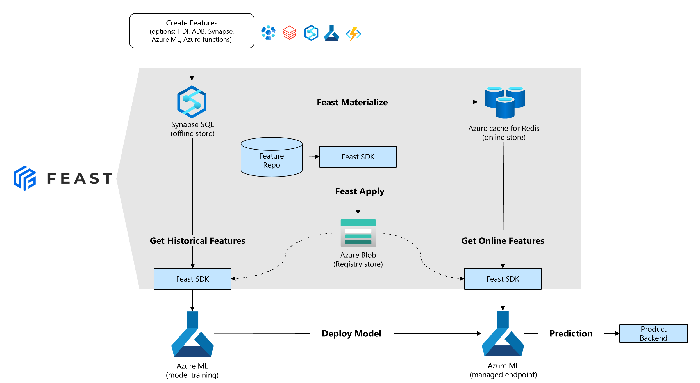

# Feast on Azure

This project provides resources to enable running a [feast](http://feast.dev) feature store on Azure.

## Feast Azure Provider
The [Feast Azure provider](./provider/README.md) acts like a plugin that allows Feast users to connect to:

- Azure SQL DB and/or Synapse SQL as the _offline store_
- Azure cache for Redis as the _online store_
- Azure blob storage for the feast _registry store_

### 📐 Architecture

The _interoperable_ design of feast means that many Azure services can be used to _produce_ and/or _consume_ features (for example: Azure ML, Synapse, Azure Databricks, Azure functions, etc).



### 🐱‍👤 Getting Started

If you want to install locally:

```bash
pip install feast-azure-provider
```

We recommend the [getting started tutorial](provider/tutorial/) that walks you through an end-to-end example.

You can deploy the infrastructure for feast using:

[](https://portal.azure.com/#create/Microsoft.Template/uri/https%3A%2F%2Fraw.githubusercontent.com%2FAzure%2Ffeast-azure%2Fmain%2Fprovider%2Ftutorial%2Fsetup%2Fazuredeploy.json)

The only 2 required parameters during the set-up are:

- **Admin Password** for the the SQL Server being deployed.
- **Principal ID** this is to set the storage permissions for the feast registry store. You can find the value for this by opening **Cloud Shell** and run the following command:

```bash
az ad signed-in-user show --query objectId -o tsv
```

## Contributing

This project welcomes contributions and suggestions.  Most contributions require you to agree to a
Contributor License Agreement (CLA) declaring that you have the right to, and actually do, grant us
the rights to use your contribution. For details, visit https://cla.opensource.microsoft.com.

When you submit a pull request, a CLA bot will automatically determine whether you need to provide
a CLA and decorate the PR appropriately (e.g., status check, comment). Simply follow the instructions
provided by the bot. You will only need to do this once across all repos using our CLA.

This project has adopted the [Microsoft Open Source Code of Conduct](https://opensource.microsoft.com/codeofconduct/).
For more information see the [Code of Conduct FAQ](https://opensource.microsoft.com/codeofconduct/faq/) or
contact [opencode@microsoft.com](mailto:opencode@microsoft.com) with any additional questions or comments.

## Trademarks

This project may contain trademarks or logos for projects, products, or services. Authorized use of Microsoft 
trademarks or logos is subject to and must follow 
[Microsoft's Trademark & Brand Guidelines](https://www.microsoft.com/en-us/legal/intellectualproperty/trademarks/usage/general).
Use of Microsoft trademarks or logos in modified versions of this project must not cause confusion or imply Microsoft sponsorship.
Any use of third-party trademarks or logos are subject to those third-party's policies.
