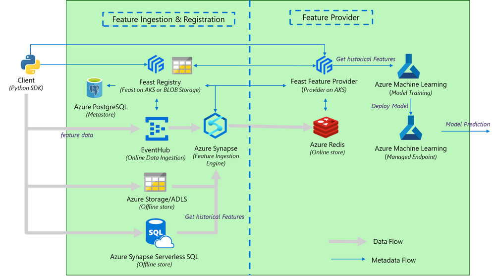

# Feast on Azure Kubernetes Service

The Feast on AKS is a secure enterprise deployment on a customer provisioned AKS cluster in an Azure VNET. This deployment does not expose any public endpoints and leverages Azure Private Link over the Feast core and serving so that the traffic flows over the Microsoft Network. This deployment also supports secure connectivity from Azure Synapse Analytics and Azure Machine Learning integration via private endpoints.
## 📐 Architecture

## Getting Started

### 1. Installation Guide 
This [Installation Guide](./setup/README.md) lists the prerequisites and steps you need to perform to install feast in your environment. It also includes the setting of Azure Synapse Analytics and Azure Machine Learning secured connectivity to Feast. You can execute these commands from your preferred Linux environment.
### 2. Setting up SDK
This [SDK Guide](./sdk/README.md) provides the instructions to install the Feast python sdk and Feast python Spark extensions sdk. 
### 3. Running the Sample
This [Samples Guide](./samples/README.md) provides the instructions to run the sample notebook from Azure Synapse Analytics and Azure Machine Learning.
### 4. Setting up Backup and Restore for Feast Postgres DB
The metadata for feature registry is stored in a single instance Postgres DB running in AKS. To provide resiliency, backup and restore instructions for the Postgres DB are provided here [Feast Backup-and-Restore](./setup/Feast_backup_restore.md). 

For help and questions about using this project, please email azurefeaturestore@microsoft.com

## 🎓 Learn more

- [Feast website](http://feast.dev)
- [Feast on Azure tutorial](./docs/tutorial/README.md)

## Contributing

This project welcomes contributions and suggestions.  Most contributions require you to agree to a
Contributor License Agreement (CLA) declaring that you have the right to, and actually do, grant us
the rights to use your contribution. For details, visit https://cla.opensource.microsoft.com.

When you submit a pull request, a CLA bot will automatically determine whether you need to provide
a CLA and decorate the PR appropriately (e.g., status check, comment). Simply follow the instructions
provided by the bot. You will only need to do this once across all repos using our CLA.

This project has adopted the [Microsoft Open Source Code of Conduct](https://opensource.microsoft.com/codeofconduct/).
For more information see the [Code of Conduct FAQ](https://opensource.microsoft.com/codeofconduct/faq/) or
contact [opencode@microsoft.com](mailto:opencode@microsoft.com) with any additional questions or comments.

## Trademarks

This project may contain trademarks or logos for projects, products, or services. Authorized use of Microsoft 
trademarks or logos is subject to and must follow 
[Microsoft's Trademark & Brand Guidelines](https://www.microsoft.com/en-us/legal/intellectualproperty/trademarks/usage/general).
Use of Microsoft trademarks or logos in modified versions of this project must not cause confusion or imply Microsoft sponsorship.
Any use of third-party trademarks or logos are subject to those third-party's policies.
