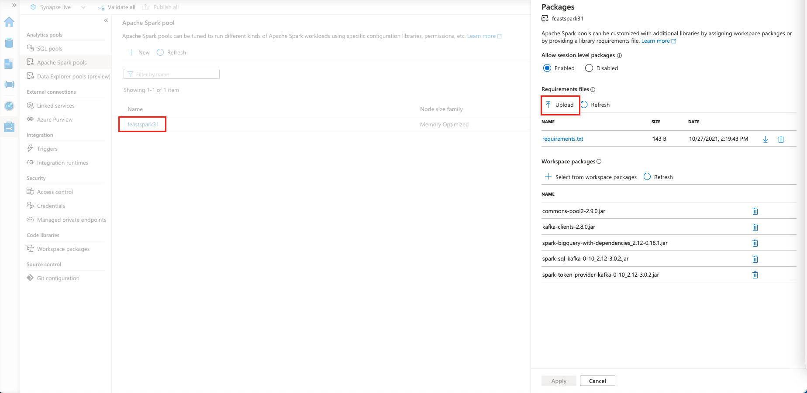
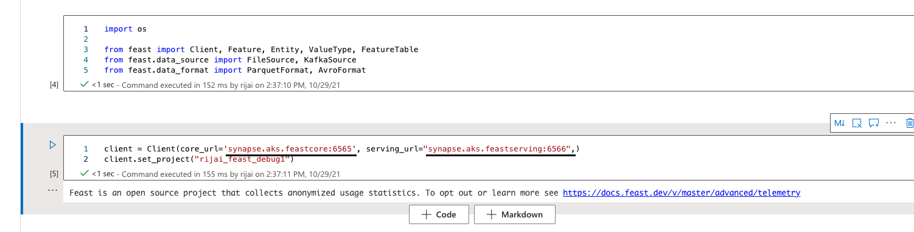
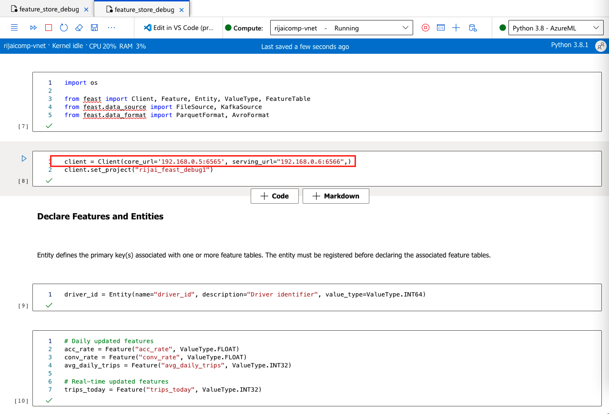

We have provided a sample notebook for a ride sharing organization usecase:

1. Register two driver features, one for driver statistics, the other for driver trips. Driver statistics are updated on daily basis, whereas driver trips are updated in real time.
2. Creates a driver dataset, then use Feast SDK to retrieve the features corresponding to these drivers from an offline store.
3. Store the features in an online store (Redis), and retrieve the features via Feast SDK.

# Using the notebook from Synapse

You can run the provided notebook from Azure Synapse once you install the required packages on your Spark pool.
- Upload the notebook to Synapse workspace
- Upload the [requirements.txt](./requirements.txt) folder to your Synapse Spark pool, as explained in this [article](https://docs.microsoft.com/en-us/azure/synapse-analytics/spark/apache-spark-manage-python-packages). This will install all the required python packages for you to execute the notebook.
     

- Change the client ip address to FQDN name you saved above.
    
- You should be able to successfully run the notebook end to end.

# Using the notebook from AML

- Change the client ip address to the IP address of the private endpoint you created as part of setup
    
- You should be able to successfully run the notebook.
- The sample notebook also submit spark jobs and in order to do so from AML, follow this [article](https://docs.microsoft.com/en-us/azure/machine-learning/how-to-use-synapsesparkstep). In this article, you'll learn how to use Apache Spark pools powered by Azure Synapse Analytics as the compute target for a data preparation step in an Azure Machine Learning pipeline.
