## Feast Backup and Restore Guide
This guide lists thesteps you to backup and restore feast in your environment. 

### Setup backup
#### Step 1: Get information

*PostgreSQL host ip*
It can be found in the Azure portal. Go to the AKS where Feast is deployed, select “Services and ingresses” in the left side menu. Look for a service called “feast-release-postgresql”. You can type or paste in the full name in the filter text box. Record the cluster IP.

*PostgreSQL password*
It will be the password you provided when configuring the Feast service

*Azure storage container with SaS key*

We will be backing up the database to an Azure storage account. If you don’t have a storage account yet, create one following the [instructions](https://docs.microsoft.com/en-us/azure/storage/common/storage-account-create?tabs=azure-portal). After the storage account is created, find the storage account in Azure portal, select “Containers” in the left side menu, click on “+ Container” button to create a new container for the backup files:

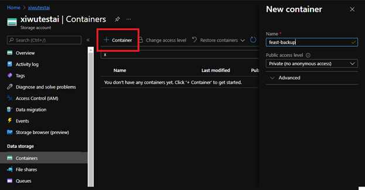

After the container is created, click on the name to go to the container details blade, select “Shared access tokens” from the left side menu and generate a SaS URL. You will need only “Write” permission for backup. Leave the start date as it and choose the expiry date according to your organization’s policy. You will need to update the SaS URL in AKS before it is expired otherwise the backup will stop working. Then click on the “Generate SAS token and URL” button and copy the Blob SAS URL (not the token!):

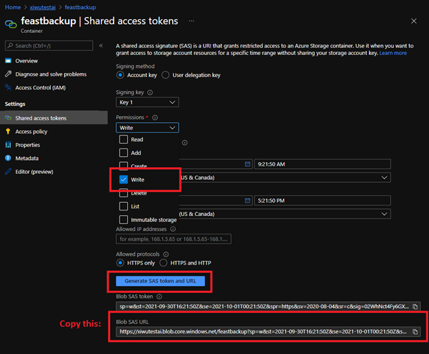

#### Step 2: Convert your information into Base64 encoded strings
AKS stores all the secret with Base64 encoded strings. If you are running this on Linux or turned on Windows Subsystem for Linux on your Windows machine, you can run the following command to generate base64 encoded string:
echo -n "<string-content>" | base64
replace <string-content> with the content and make sure you have -n option on. You can also find online tools to do Base64 encodings. 
You will need to following information being encoded:

*PostgreSQL host ip*
it is the IP address you found in step 1.

*PostgreSQL password*
It should be in following format:
<host>:5432:postgres:postgres:<password>
where 5432 is the port, the first postgres is the database name and the second postgres is the username. 

*Storage container SaS URL*
It is the SaS URL you found in step 1. If you are using the echo command for the encoding, make sure you remove all the newline breakers from the result and make it a single line string

#### Step 3: Create secrets in AKS
Copy the backup secrets template from the [template]() file and replace the secret values with the base64 strings you generated in step2. Go to the AKS blade in Azure portal, select Configuration in the left side menu and click on “+ Add” and then choose “Add with YAML”.

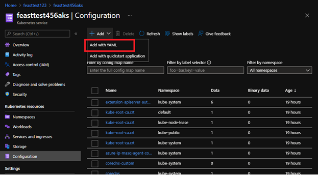

Paste the template (with updated values) in the textbox and click on Add button
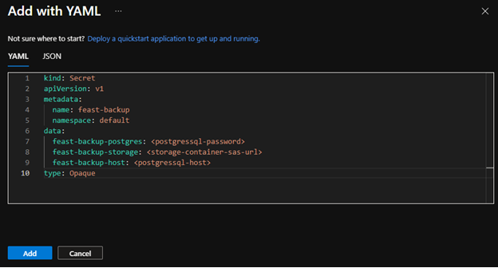

#### Step 4: Create Cron Job to schedule backup
Copy the Backup cron job template from the [template]() file. Go to AKS blade in Azure portal, select “Workloads” in the left side menu, click on the “+ Add” button and choose “Add with YAML”

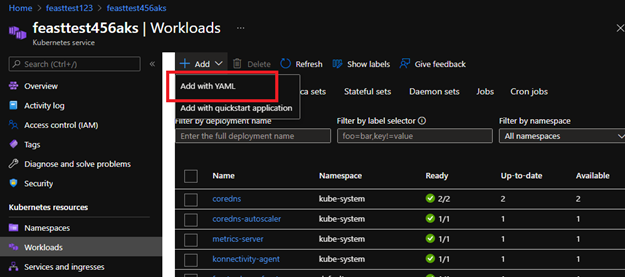

Paste the backup cron job template in the textbox and click on Add button to add the job. The default scheduling will run the job every 2 minutes so we can test it immediately.

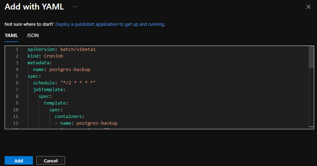

Wait for 2-3 minutes the first backup file should show up in the storage container. You can verify it by go to the Azure storage blade, choose “Storage browser (preview)” in the left side blade, choose your backup container under “Blob Containers”. All backup files should be stored in a folder called “backups”.

#### Step 5: Troubleshoot
If the backup file is not generated, you can troubleshoot the job execution using container log. First you need to enable Azure Monitor for containers. Go to the AKS blade in Azure portal, choose “Logs” in the left side menu, choose a Log Analytics workspace and click on “Enable” button.

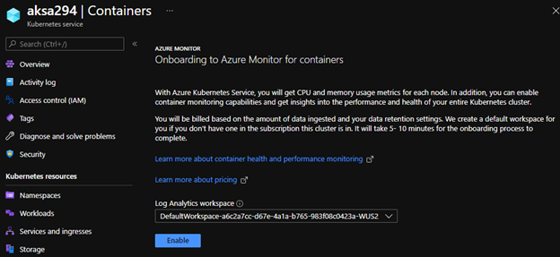

It will take a few minutes to configure and connect your AKS cluster to Azure Monitor. To query the container log, you need to get the container id. Choose Workloads in the left side menu and go to “Cron jobs” tab

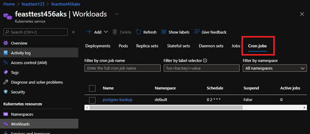

Click on the job called postgres-backup and then click into the last job (you can sort them by age). Then click into the pod (should see only one pod), and then click into the container (should see only one container). You will see the container id there. Copy the id without “containerd://”

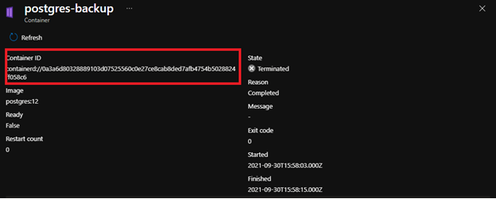

Go back to the Logs, and run the following query with the container id:
ContainerLog | where ContainerID == "<your-container-id>"

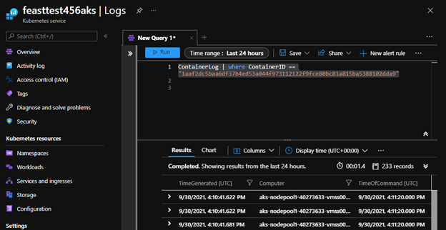

You should be able to find out the error from the log.

#### Step 6: Update backup scheduling

After confirming the backup is running, you should go back to the cron job and update the backup scheduling. Choose Workloads in the left side menu and go to Cron job tab, click into the postgres-backup job. Choose “YAML” to show the YAML configuration. Scroll down and navigate to the line schedule: '*/2 * * * *'. 
You can update the schedule according to your backup policy. For example, ‘0 2 * * *’ will run the backup job every day at 2AM (UTC). If you are not sure about the expression, go to [link](https://crontab.guru/) and test it out before your update the job configure. 

After you update the scheduling, save the update. You may get 409 conflict error if you stayed on the page for too long (the backup job is still running every 2 minutes and updating this YAML configuration), simply refresh and try it again.

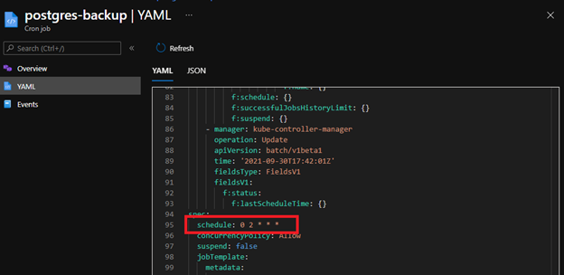

#### Step 7: Backup clean up

The backup cron job will not delete any backup files. You may want to clean up the backup files manually.

### Restore the database
In case the database went down or corrupted, you can restore the database from the backup file.

#### Step 1: Choose the backup file to restore from
Go to the storage account blade in Azure portal, choose “Storage browser (preview)” in the left side menu and choose your backup container. You will see all available backup files. Choose the file you want to restore from (usually the latest backup) and click on the file name

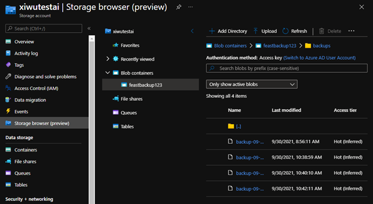

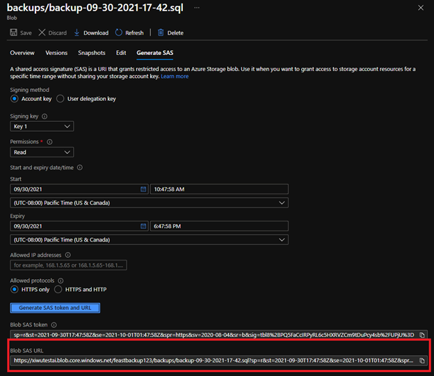

#### Step 2: Convert all information to base64 string
You can see step 2 in the backup section about why and how to convert to base64 string. In addition of the information you collected and converted for backup job, you will need:

*Backup blob SAS URL*
The SAS URL you found in step 1

*PostgreSQL password for database template1*
In order to restore the database, we need to drop and recreate the database. This operation can only be done when connecting to a different database. The password should be the same but they to be stored as separate secret entry in AKS (eventually the .pgpass file for psql). The format for the password for database template1 should be:
<host>:5432:template1:postgres:<password>

#### Step 3: Create restore secrets
Copy the restore secrets template from the [template]() file and replace the secret values with the base64 strings you generated in step2. Go to the AKS blade in Azure portal, select Configuration in the left side menu and click on “+ Add” and then choose “Add with YAML”.

Paste the template (with updated values) in the textbox and click on Add button

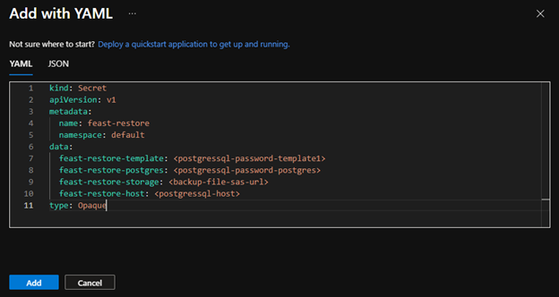

#### Step 4: Create a pod to run restore
We will run the restore by creating a pod with PostgreSQL image. Copy the Restore cron job template from the [template]() file. Go to AKS blade in Azure portal, select “Workloads” in the left side menu, click on the “+ Add” button and choose “Add with YAML”

Paste the restore cron job template in the textbox and click on Add button to add the job. The pod should be created immediately.

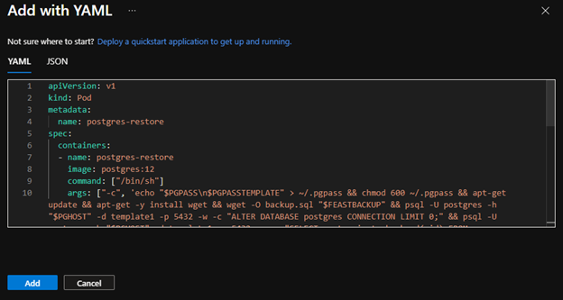
Go back to the Workloads page and go to Pods tab, type in postgres-restore in the filter textbox. You may see the pod is not in Ready state. Don’t worry about it, the pod will go offline immediately after the restore is finished. 

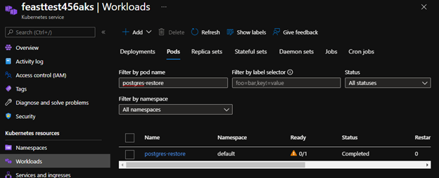
Click into the job and click into the container (should only see 1 container). You will see the container ID

Follow the troubleshot step (step 6) in the backup section and get the restore log. Sort the log by TimeGenerated [UTC] in descending order, you should see “restored database” as the last log entry. If you can’t find the entry, search through the log for the errors.

#### Step 5: Clean Up
You may want to delete the restore secrets and pod you created after the restore is completed as they are no longer needed.

