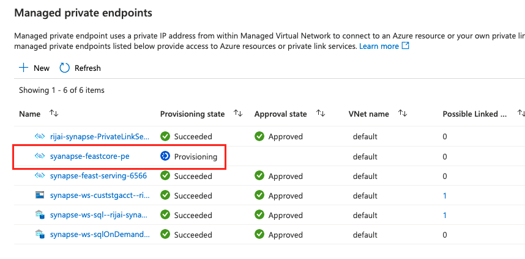

## Installation Guide
This guide lists the prerequisites and steps you need to perform to install feast in your environment. You can execute these commands in your preferred Linux environment.

__NOTE: Since the script requires sudo priveleges, Azure Cloudshell is not a recommended environment.__

Before you proceed, here are prerequisites to install feast in your Azure subscription.
- An Existing virtual network (VNET) and subnet.
- Azure Kubernetes (AKS) cluster in that VNET.

__PLEASE NOTE: Currently we only support Kubernetes version 1.21.7, which is default version for AKS.__

You can jump to the [install feast section](#-steps-to-install-feast) if you already have the prerequisite resources.

Here are the commands to create VNET and AKS cluster in that VNET. For more details refer to the documentation [here](https://docs.microsoft.com/en-us/azure/aks/configure-kubenet).

```bash
# Create a Resource group
sudo az group create --name myakstest --location eastus2

# Create a new VNET
sudo az network vnet create \
    --resource-group myakstest \
    --name myAKSVnet \
    --address-prefixes 192.168.0.0/16 \
    --subnet-name myAKSSubnet \
    --subnet-prefix 192.168.1.0/24
    --location eastus2

# To allow an AKS cluster to interact with other Azure resources, an Azure Active Directory service principal (SP) is used. The service principal needs to have permissions to manage the virtual network and subnet that the AKS nodes use.
# Create a Service principal
sudo az ad sp create-for-rbac --skip-assignment

# Give Network Contributor permissions

VNET_ID=$(sudo az network vnet show --resource-group myakstest --name myAKSVnet --query id -o tsv)

SUBNET_ID=$(sudo az network vnet subnet show --resource-group myakstest --vnet-name myAKSVnet --name myAKSSubnet --query id -o tsv)

sudo az role assignment create --assignee <SP_app_id> --scope $VNET_ID --role "Network Contributor"

# Finally create the AKS cluster with default networking
sudo az aks create \
    --resource-group myakstest \
    --name myAKSCluster \
    --node-count 3 \
    --network-plugin kubenet \
    --service-cidr 10.0.0.0/16 \
    --dns-service-ip 10.0.0.10 \
    --pod-cidr 10.244.0.0/16 \
    --docker-bridge-address 172.17.0.1/16 \
    --vnet-subnet-id $SUBNET_ID \
    --service-principal <SP_app_id> \
    --client-secret <SP_client_secret>

```

## Steps to install Feast

1. Clone the repo and navigate to the cluster folder where [installfeast.sh](./installfeast.sh) script is located.
2. Check the permission on the script by running the following command, the script should have executable permissions.
    ```shell
    ls -al ./installfeast.sh
    ```
    Output should look similar to this, r = read, w = write and x= executable
    ```shell
    -rwxr-xr-x  1 myuser  staff  3385 Oct  6 13:34 installfeast.sh
    ```

3. If it does not not have executable permissions(x), you can add it by running this command
    ```shell
    $ sudo chmod 755 ./installfeast.sh
    ```
4. Run az login command to make sure you are logged into Azure CLI to execute CLI commands

    ```shell
    $ sudo az login
    ```

4. Before you run the script you need the following information
   - Resource Group (-r) : An existing Resource Group Name or a new resource group will be created if it doesn't exist.
	- Subscription_id (-s) : Azure Subscription Id. The default subscription will be used if not specified"
	- AKS Cluster Name (-n) - Name of the existing AKS cluster
    - Password (-p): Password to set for the Postgres SQL Database


    
5. Here is what a sample command looks like
    ```shell
    $ sudo ./installfeast.sh -s a6c2a7cc-123-4a1a-b765-xxxxx -r myfeastRG -n myAKSCluster -p <your_password_for_db>
    ```
    NOTE: You might have to run the script as root user depending on your access level.

6. Once your deployment is finished you will see feast services running under the *Services and Ingresses* option for the AKS cluster 

    


## Accessing the feast service

### From the same virtual network as the AKS cluster
Clients in same VNET can invoke the feast service directly through the Pod IP address as shown below 
    


Use the cluster IP address to run the test script and verify feast installation.
To do so you need to set up your feast dev environment first
1. Create Azure Ubuntu VM in same VNET as AKS managed resource group and make sure you can ssh into it by opening up port 22.
1. Install feast 0.9 version in your environment
   ```bash
    sudo apt-get update
    sudo apt-get -y install python3-pip
    pip3 install -r requirements.txt # it is under samples folder
    ```    
1. Edit [test_featurestore.py](./test_featurestore.py) and update the ipaddress to the cluster IP address of **internal-feast-core** service from the above step.

    

5. Run the above script using following command
   ```python
    python3 test_featurestore.py
   ```
5. You should see this output:

   

    **Congratulations you have successfully deployed feature store !** 

    

### From a different virtual network as the AKS cluster

The Feast services running on AKS cluster can be exposed via an internal load balancer and private link service. Clients (Azure VM/ Synapse Notebooks/ Azure ML notebooks) running on separate virtual network can connect to them via private endpoint.

#### __a. Connecting through Azure Synapse__

The Feast services running on AKS cluster can be exposed via an internal load balancer and private link service. Clients (Azure VM/ Synapse Jobs/ Azure ML notebooks) running on separate virtual network can connect to them via private endpoint running in same virtual network as the client. Here is the topology for it

  

Here are the steps you need to follow to access the feast service through virtual private network.
1. [Create AKS Service to expose Feast service components via Internal load balancer](#-Create-AKS-Service-to-expose-Feast-service-components-via-load-balancer)
1. [Create a private link service to expose the feast service endpoints on ILB](#-Create-a-private-link-service-to-expose-the-feast-service-endpoints)
1. [Create private endpoint to connect your client to private link service](#-Create-private-endpoint-to-connect-your-clients-to-private-link-service)

Here is a simplistic flow diagram of the above topology

__*Client --> Private Endpoint --> Private Link --> Internal Load Balancer --> Feast Service on AKS*__


#### 1. Create AKS Service to expose Feast service components via load balancer  <br/>

Here is the Azure [documentation](https://docs.microsoft.com/en-us/azure/aks/internal-lb) that walks through the steps in more details. Below are the actual commands
   - Set the Kubectl config to your cluster
        
        ```bash
        #Select your cluster
        az aks get-credentials --resource-group myResourceGroup --name myAKSCluster

        #Verify connection
        kubectl get nodes
        ```

   - To create an internal load balancer, create two service manifest named *internal-lb-feastserving.yaml* and *internal-lb-feastcore.yaml* with the service type LoadBalancer and the azure-load-balancer-internal annotation as shown below:
    
  #### internal-lb-feastserving.yaml
    
   ```yml
    apiVersion: v1
    kind: Service
    metadata:
      name: internal-feast-serving
      annotations: 
        service.beta.kubernetes.io/azure-load-balancer-internal: "true"
    spec:
      type: LoadBalancer
      ports:
        - name: port-1
          protocol: TCP
          port: 8080
          targetPort: 8080
        - name: port-2
          protocol: TCP
          port: 6566
          targetPort: 6566
      selector:
        app: feast-online-serving
        component: serving
        release: feast-release

  ```
#### internal-lb-feastcore.yaml

   ```yml
    apiVersion: v1
    kind: Service
    metadata:
        name: internal-feast-core
        annotations: 
          service.beta.kubernetes.io/azure-load-balancer-internal: "true"
    spec:
        type: LoadBalancer
        ports:
          - name: port-1
            protocol: TCP
            port: 8080
            targetPort: 8080
          - name: port-2
            protocol: TCP
            port: 6565
            targetPort: 6565
        selector:
            app: feast-core
            component: core
            release: feast-release
  ```

- Deploy the services using the kubectl apply and specify the name of your YAML manifest:
    ```bash
    kubectl apply -f internal-lb-feastserving.yaml
    #Output - service/internal-feast-serving created

    kubectl apply -f internal-lb-feastcore.yaml
    # Output - service/internal-feast-core created

    #Verify the services are created
    kubectl get services 

    # Output
    #internal-feast-core                            LoadBalancer   10.0.34.144    <pending>     8080:30442/TCP,6565:32265/TCP   4m26s
    #internal-feast-serving                         LoadBalancer   10.0.138.42    <pending>     8080:30518/TCP,6566:30899/TCP   4m33s
    ```

    At this point you can go the Managed Resource group for your AKS cluster, you will find an internal load balancer with the name *kubernetes-internal*.
    You can find the managed resource group, under properties tab of AKS cluster on the left menu.
  
    
  
    


    Under Front End IPs you will find the two AKS services we just created

    

    If you click on any of them, you will load balancing rules with ports that we defined in .yaml manifest

    

    #### 2. Create private link services to expose the feast service endpoints

    Now load balancer is all setup with internal ips for feast service, we need to create a privare link to access it. Here is a detailed [document](https://docs.microsoft.com/en-us/azure/private-link/create-private-link-service-portal) for this, quick instructions below
    - On Azure portal, go to Private Link Center and click on Create Private link service 

    

- Provide the name and region, make sure the region is same as the one for your AKS cluster.
  
    

- Select the Internal load balancer (kubernets-internal) for your AKS cluster
  
    

- There are two front end IP address - feast-core and feast serving service, pick the feast-core service
  
    

- Keep default options for other settings and click Create. Here is the resource view once it is created. Please make a note of the **private endpoint connections** tab on the left

    

    __Repeat the above steps and create a private link for feast-serving service.__


    #### 3. Create private endpoint to connect your clients to private link service

    Some services in Azure provide managed private endpoints, this documentation walks through how you can connect through Synapse workspace to your feast service. For other clients, just create a private endpoint in the same VNET as the client and you will be able to connect to it.

- To create private endpoint in Synapse, you need to create a synapse workspace that has Managed workspace virtual network. To create one, follow this [article](https://docs.microsoft.com/en-us/azure/synapse-analytics/security/synapse-workspace-managed-vnet). To check, if you can use private endpoints with your workspace, go to your Workspace > Manage tab (on left) > Managed Private endpoints should be enabled.

    

- Hit new button to create private endpoint and select private link service for destination

    

- Provide a name, select the subscription and the private link service under it. You need to provide a FQDN name to access your service. From Synapse notebooks/jobs you can connect to the service using this FQDN. Make note of this FQDN

    

- After creation, the endpoint will still show in provisioning state, at this point you need to go back to Private Link Center. 
    
    

- You will see the newly create private endpoint, under pending connections, please approve it. You will notice that the provisioning state in Synapse also changes to approved.
    
    


    **Next, repeat the above steps to create another private endpoint for feast-serving service.** 

#### b. __Connecting through Azure ML__

 Here is the topology for connecting to Feast Service on AKS from Azure ML.
  

For the training notebooks/jobs to connect to Feast Service in a different VNET, the compute instance or compute cluster needs to be in the same VNET as the private endpoint.

For inference notebooks/jobs to connect connect to Feast Service in a different VNET, the inference cluster needs to be in the same VNET as the private endpoint.

You can put the compute instance or compute cluster in a VNET by selecting "Enable Virtual Network" under the Advanced settings tab

  
  

Similarly you can put an inference cluster in a VNET from Advanced settings too.

  

Next, create a private link service for feast service running on AKS's internal load balancer by following the steps above. 

Lastly, create a private endpoint in same region as AML compute to connect with private link you just created. AML does not support outbound managed private endpoints, so you will create one by going to Private Link center on Azure portal, you can follow this [documentation](https://docs.microsoft.com/en-us/azure/private-link/create-private-endpoint-portal) for actual steps.


__You have successfully set up a private connection from your client to Feast Service, next you can run the provided sample [here](../samples/README.md)__


