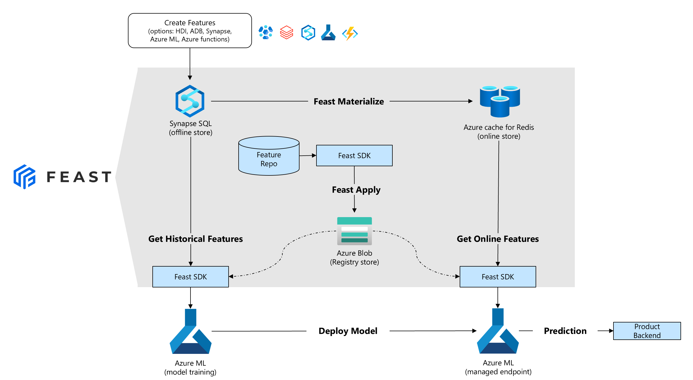

# Feast Azure Provider

This goal of this project is to create an Azure provider for [Feast](http://feast.dev), which is an open source feature store. The Feast Azure provider acts like a plugin that allows Feast users to connect to:

- Azure SQL DB and/or Synapse SQL as the _offline store_
- Azure cache for Redis as the _online store_
- Azure blob storage for the feast _registry store_

## 📐 Architecture

The _interoperable_ design of feast means that many Azure services can be used to _produce_ and/or _consume_ features (for example: Azure ML, Synapse, Azure Databricks, Azure functions, etc).



## 🐱‍👤 Getting Started

### 1. Install Feast Azure Provider

Git clone this repo and then:

```bash
cd provider/sdk
pip install code/.
```

**Note: Best practice is to use environment isolation (for example: virtualenv or conda) when installing**
 
### 2. Connect to your feature store

To connect to your feature store, you can use either:

- Feast Python SDK, or
- Feast CLI

#### a.) Using the Feast Python SDK

```python
import os
from feast import FeatureStore, RepoConfig
from feast.registry import RegistryConfig
from feast_azure_provider.mssqlserver import MsSqlServerOfflineStoreConfig, MsSqlServerSource

from feast import Entity, Feature, FeatureView, ValueType
from datetime import timedelta

# update this to your location
registry_blob_url = "https://<ACCOUNT_NAME>.blob.core.windows.net/<CONTAINER>/<PATH>/registry.db"

# update with your connection strings
sql_conn_string = "mssql+pyodbc://<USER_NAME>:<PASSWORD>@<SERVER_NAME>.database.windows.net:1433/<DB_NAME>?driver=ODBC+Driver+17+for+SQL+Server&autocommit=True"

redis_conn_string = "<CACHE_NAME>.redis.cache.windows.net:6380,password=<PASSWORD>,ssl=True"

reg_config = RegistryConfig(
    registry_store_type="feast_azure_provider.registry_store.AzBlobRegistryStore",
    path=registry_blob_url,
)

repo_cfg = RepoConfig(
    registry=reg_config,
    project="production",
    provider="feast_azure_provider.azure_provider.AzureProvider",
    offline_store=MsSqlServerOfflineStoreConfig(
        connection_string=sql_conn_string
        ),
)

store = FeatureStore(config=repo_cfg)
```

#### b.) Using the Feast CLI

Create your feature_store.yaml, which should contain the following:

```yaml
project: production
registry: 
    registry_store_type: feast_azure_provider.registry_store.AzBlobRegistryStore
    path: https://<ACCOUNT_NAME>.blob.core.windows.net/<CONTAINER>/<PATH>/registry.db
provider: feast_azure_provider.azure_provider.AzureProvider
offline_store:
    type: feast_azure_provider.mssqlserver.MsSqlServerOfflineStore
    connection_string: mssql+pyodbc://<USER_NAME>:<PASSWORD>@<SERVER_NAME>.database.windows.net:1433/<DB_NAME>?driver=ODBC+Driver+17+for+SQL+Server&autocommit=True
online_store:
    type: redis
    connection_string: <CACHE_NAME>.redis.cache.windows.net:6380,password=<PASSWORD>,ssl=True
```

To apply features:

```bash
feast apply
```

To materialize features (adjust start and end times accordingly):

```bash
feast materialize '2021-08-01T19:20:01' '2021-08-03T19:20:01'
```

## 🎓 Learn more

- [Feast website](http://feast.dev)
- [Feast on Azure tutorial](./docs/tutorial/README.md)

## Contributing

This project welcomes contributions and suggestions.  Most contributions require you to agree to a
Contributor License Agreement (CLA) declaring that you have the right to, and actually do, grant us
the rights to use your contribution. For details, visit https://cla.opensource.microsoft.com.

When you submit a pull request, a CLA bot will automatically determine whether you need to provide
a CLA and decorate the PR appropriately (e.g., status check, comment). Simply follow the instructions
provided by the bot. You will only need to do this once across all repos using our CLA.

This project has adopted the [Microsoft Open Source Code of Conduct](https://opensource.microsoft.com/codeofconduct/).
For more information see the [Code of Conduct FAQ](https://opensource.microsoft.com/codeofconduct/faq/) or
contact [opencode@microsoft.com](mailto:opencode@microsoft.com) with any additional questions or comments.

## Trademarks

This project may contain trademarks or logos for projects, products, or services. Authorized use of Microsoft 
trademarks or logos is subject to and must follow 
[Microsoft's Trademark & Brand Guidelines](https://www.microsoft.com/en-us/legal/intellectualproperty/trademarks/usage/general).
Use of Microsoft trademarks or logos in modified versions of this project must not cause confusion or imply Microsoft sponsorship.
Any use of third-party trademarks or logos are subject to those third-party's policies.
