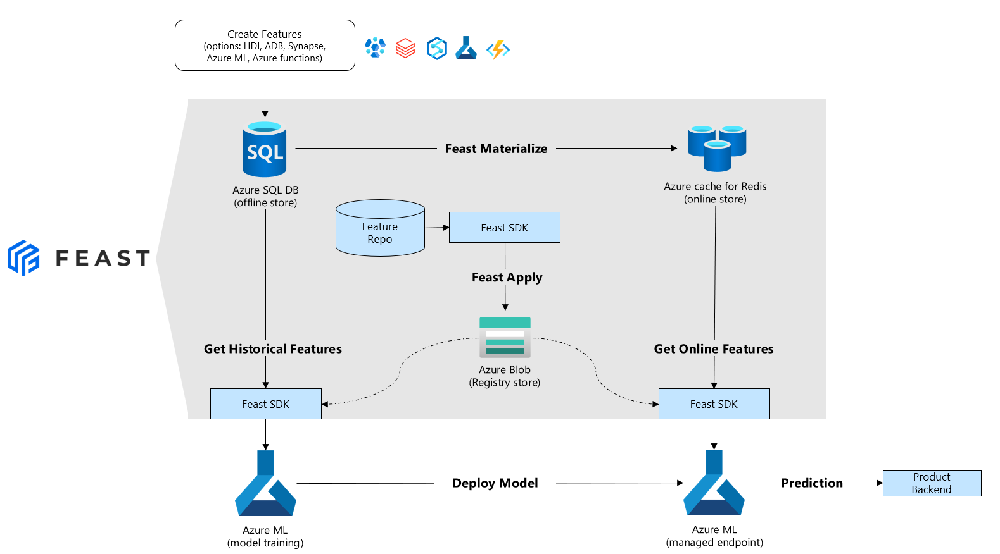
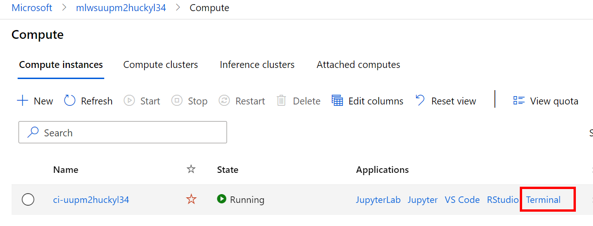
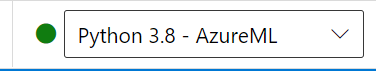

# Getting started with Feast on Azure

In this tutorial you will:

1. Deploy the infrastructure for a feature store (using an ARM template)
1. Register features into a central feature registry hosted on Blob Storage
1. Consume features from the feature store for training and inference

## Prerequisites

For this tutorial you will require:

1. An Azure subscription
1. An Azure ML Workspace
1. Good working knowledge of Python and ML concepts.
1. Basic understanding of Azure ML - using notebooks, job submission, etc.

## 1. Deploy Infrastructure

We have created an ARM template that deploys and configures all the infrastructure required to run feast in Azure. This makes the set-up very simple - select the **Deploy to Azure** button below.

The only 2 required parameters during the set-up are:

- **Admin Password** for the the SQL Server being deployed.
- **Principal ID** this is to set the storage permissions for the feast registry store. You can find the value for this by opening **Cloud Shell** and run the following command:

```bash
az ad signed-in-user show --query objectId -o tsv
```
[](https://portal.azure.com/#create/Microsoft.Template/uri/https%3A%2F%2Fraw.githubusercontent.com%2FAzure%2Ffeast-azure%2Fmain%2Fprovider%2Ftutorial%2Fsetup%2Fazuredeploy.json)



The ARM template will not only deploy the infrastructure but it will also:

- automatically clone this repository to your compute instance
- install the feast azure provider on the compute instance
- set the SQL DB and Redis cache connection strings in the Azure ML default Keyvault.

> **NOTE: It can take up to 20 minutes for the Redis cache to be provisioned.**

### 2. Load feature values into Feature Store

For this tutorial, we will create and load features into the store using a python script. 

In the [Azure Machine Learning Studio](https://ml.azure.com), navigate to the left-hand menu and select **Compute**. You should see your compute instance running, select **Terminal**



In the terminal you need to execute a python script that will load dummy data into our feature store:

```bash
conda activate azureml_py38
cd ../feast-azure/provider/tutorial/setup
python load_data.py
```

## 3.Register features in Feature store

In the Azure ML Studio, open the [01-register-features.ipynb](notebooks/01-register-features.ipynb) notebook. __Ensure that the jupyter kernel is set to Python 3.8 - AzureML__:



## 4.Train and Deploy a model using the Feature Store

In the Azure ML Studio, open the [02-train-and-deploy-with-feast](notebooks/02-train-and-deploy-with-feast.ipynb) notebook. __Again, ensure that the jupyter kernel is set to Python 3.8 - AzureML__.

